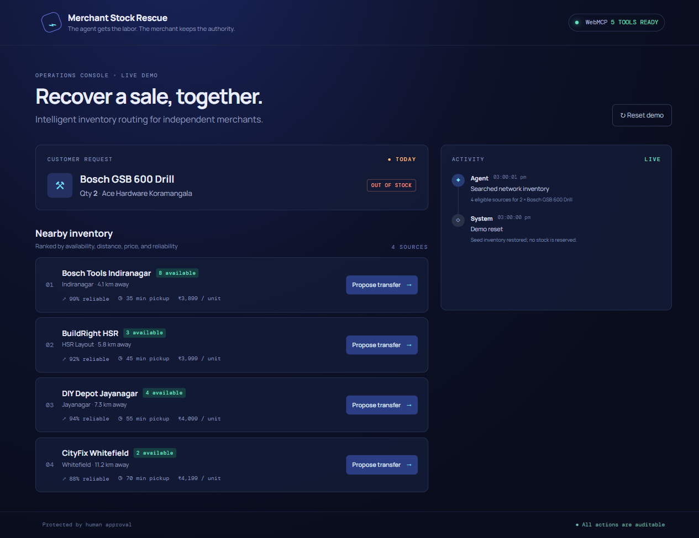
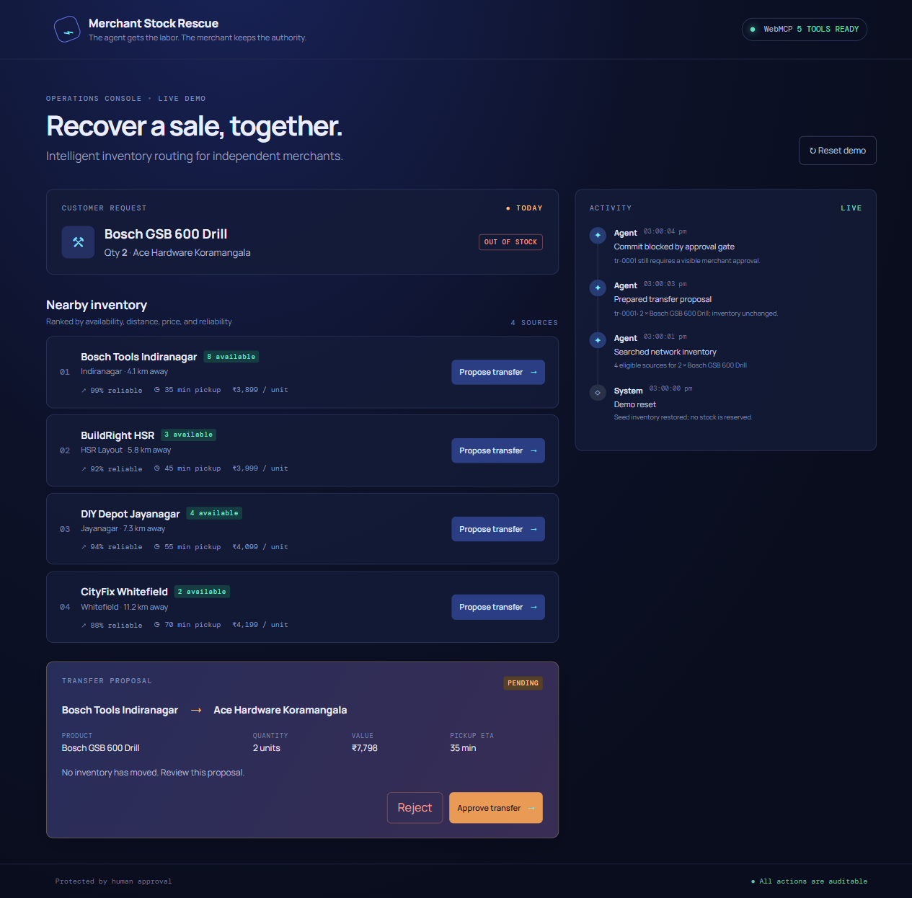
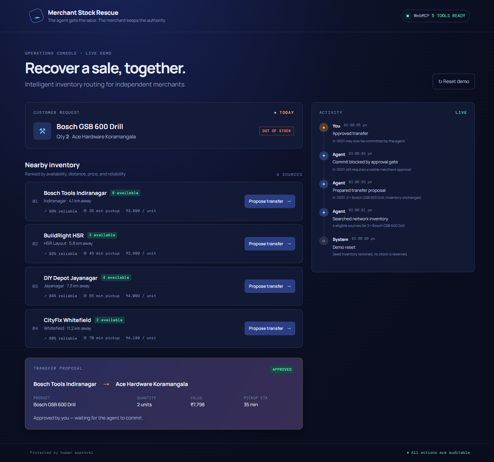
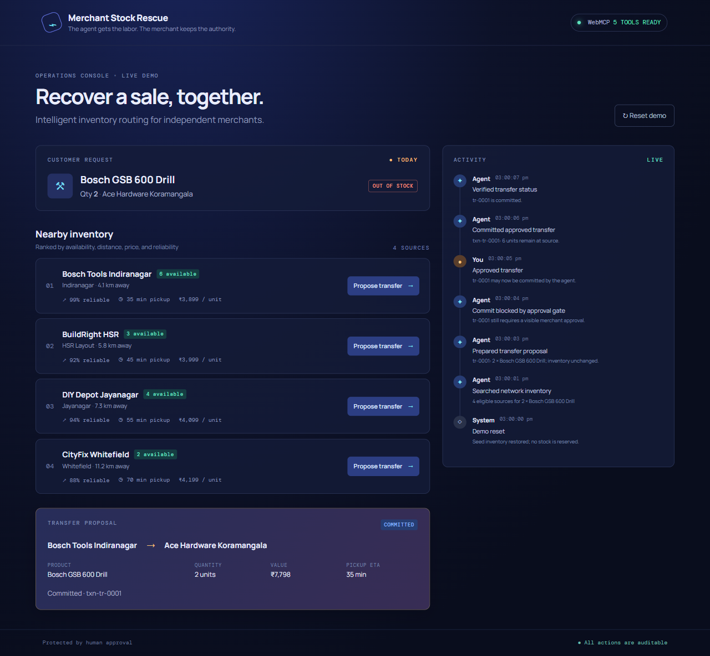

# Merchant Stock Rescue

Merchant Stock Rescue is a deterministic, browser-local WebMCP demo for independent merchants. An agent finds nearby stock and prepares the operational work; the merchant keeps authority over the consequential transfer.

## What it demonstrates

The app registers exactly five tools through the browser's `document.modelContext` API:

1. `inventory.search_network_stock` — find eligible sources for a product and quantity.
2. `inventory.get_source_details` — inspect one source before planning.
3. `inventory.prepare_transfer` — create a visible, pending proposal without changing stock.
4. `inventory.commit_transfer` — commit only an explicitly UI-approved proposal and return an audit receipt.
5. `inventory.get_transfer_status` — verify state, approval, and transaction ID.

The safety boundary is intentional: preparing is agent work, approval is a visible merchant action, and commit is agent work that the store rejects unless the matching proposal is approved. Rejected, stale, already-committed, invalid, and insufficient-stock requests return structured errors. Data is seeded locally and resettable, so the demo is repeatable and has no backend or real inventory side effects.

## Screenshots






## Run locally

Requirements: Node.js 20.19+ (or Node.js 22.12+).

```bash
npm install
npm run dev
```

For a production check:

```bash
npm run build
npm test
```

The repository includes unit tests for store transitions, tool contracts, validation, and the approval gate. It also includes a real-browser registration harness used to verify tool registration. This documentation does not claim that Chrome Inspector/WebMCP was tested manually.

### Chrome WebMCP notes

WebMCP support is browser-dependent and experimental. In a compatible Chrome build, enable the WebMCP/Model Context API flag if that build exposes one, then reload the app. The page must run in a secure context (HTTPS, or localhost during development). Without `document.modelContext`, the UI reports `5 TOOLS • ENABLE FLAG`; the local inventory demo still renders, but external tool registration is unavailable.

## Deterministic demo

1. Reset the demo and search the seeded request (the app performs the initial search on load).
2. Use the agent-facing tool to call `inventory.prepare_transfer` with the displayed source, destination, product, and quantity.
3. Try `inventory.commit_transfer` immediately: it must fail with `HUMAN_APPROVAL_REQUIRED`.
4. Click **Approve transfer** in the visible proposal card.
5. Call `inventory.commit_transfer` with the returned transfer ID; verify the `txn-tr-0001` receipt, reduced source stock, and audit timeline.
6. Call `inventory.get_transfer_status` to verify `committed` and `approvedByHuman: true`.

## Architecture

React + TypeScript + Vite render the console. A single browser-local `AppStore` owns seeded merchants, products, inventory, proposals, receipts, and the activity timeline. The UI and all five WebMCP handlers call that same store, making the approval state authoritative and observable. Candidate ranking is deterministic by price, distance, pickup time, and reliability.

## Limitations and failure cases

There is no persistence, authentication, network inventory, or real transfer fulfillment. Invalid IDs and quantities, unknown products, duplicate commits, rejected proposals, insufficient stock, and commits attempted before approval are handled as structured failures. A refreshed page restores the seed data.

## Links

- Repository: https://github.com/Bitshank-2338/merchant-stock-rescue
- Live demo: https://merchant-stock-rescue.vercel.app
- Video: **TODO: add demo video URL**

A narrated 2:24 draft video is rendered locally at `output/video/merchant-stock-rescue-demo.mp4` and only needs public YouTube upload.

## License

Released under the [MIT License](LICENSE).
